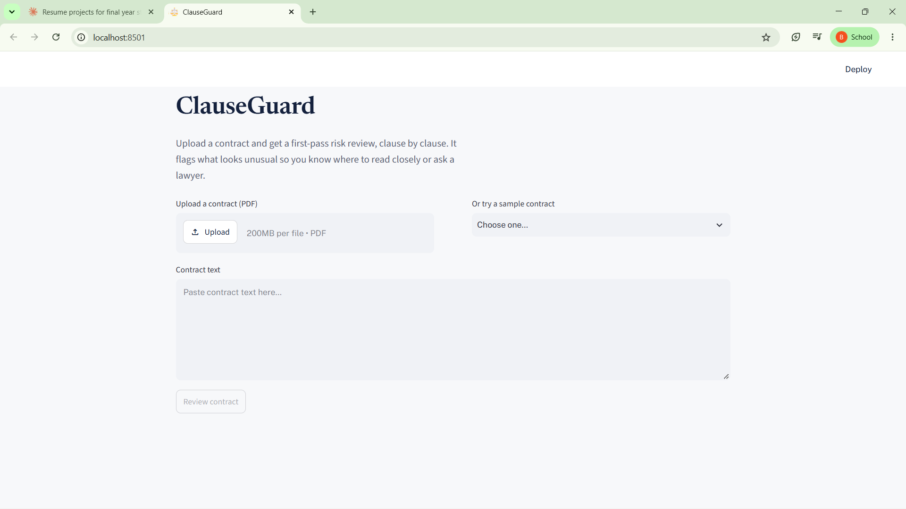
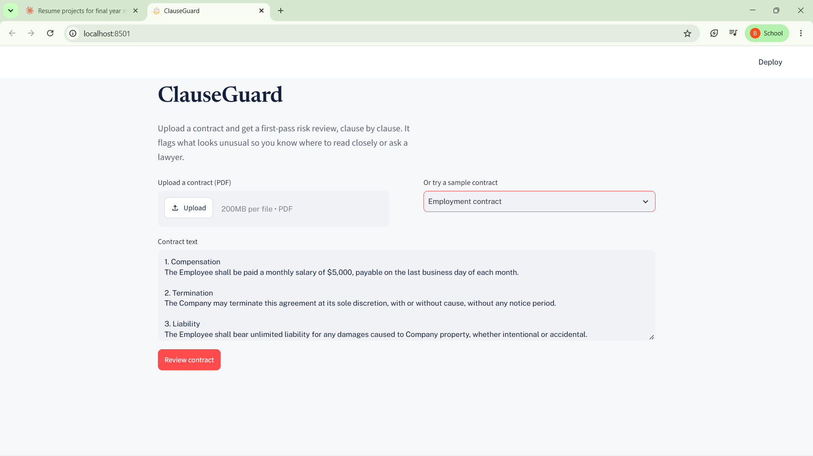
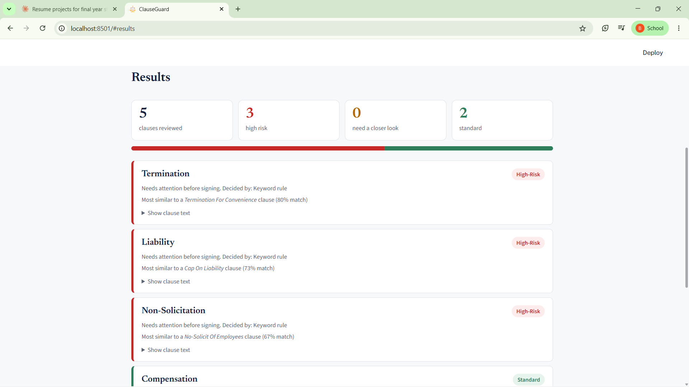
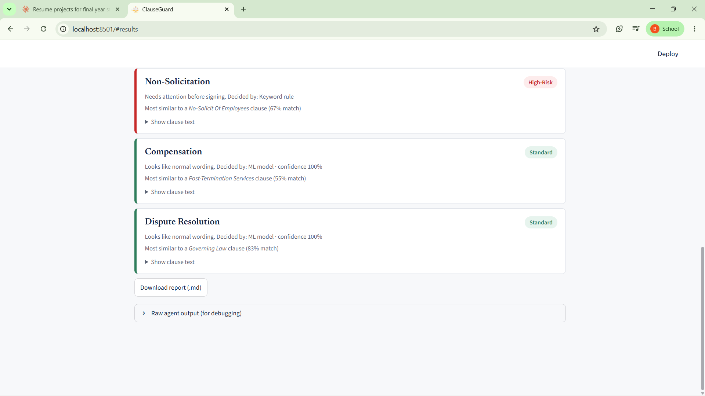

# ClauseGuard: Multi-Agent Contract Risk Reviewer

ClauseGuard reads a contract clause by clause and flags the ones that look risky. It combines keyword rules, a trained ML classifier, semantic retrieval and an LLM fallback whose answers must quote the source text. It is a first-pass check, not a replacement for a lawyer.

## Demo

<table>
  <tr>
    <td width="50%"><br><sub>Home: upload a PDF, paste text or pick a sample</sub></td>
    <td width="50%"><br><sub>Sample contract loaded</sub></td>
  </tr>
  <tr>
    <td width="50%"><br><sub>Risk summary and flagged clauses</sub></td>
    <td width="50%"><br><sub>Standard clauses and report download</sub></td>
  </tr>
</table>

## How it works

```
Contract text -> Extractor -> Retriever -> Risk-Flagger -> Summarizer -> Report
```

| Agent        | What it does                                                                                                                     | Tools                |
| ------------ | -------------------------------------------------------------------------------------------------------------------------------- | -------------------- |
| Extractor    | Splits the contract into clauses using heading patterns                                                                          | Python, regex        |
| Retriever    | Finds the most similar reference clause                                                                                          | Sentence-BERT, FAISS |
| Risk-Flagger | Labels each clause using three layers, in order: keyword rules, then an XGBoost classifier, then an LLM when the model is unsure | XGBoost, Groq LLM    |
| Summarizer   | Builds a report sorted by risk                                                                                                   | LangGraph            |

The LLM must return an exact quote from the clause as evidence. If the quote is not found in the clause text, the answer is rejected and the clause is sent to human review. If the API call fails, the clause is also sent to human review instead of being retried silently.

## Results

Data: 10,114 clauses from the [CUAD](https://github.com/TheAtticusProject/cuad) dataset (8,833 Standard, 1,281 High-Risk). 80/20 stratified split.

- 5-fold cross-validated weighted F1: **0.872 ± 0.006**
- Held-out accuracy: **0.90**

Ablation on the held-out set, High-Risk class:

| Approach            | Precision | Recall | F1   |
| ------------------- | --------- | ------ | ---- |
| Keyword rules only  | 0.13      | 0.02   | 0.03 |
| ML classifier only  | 0.77      | 0.26   | 0.39 |
| Rules + ML combined | 0.57      | 0.28   | 0.37 |

**Finding:** letting the keyword rules override the ML model lowered precision (0.77 to 0.57) for only a small gain in recall, so the combined system did not beat the ML model alone.

## Limitations

- **Low recall on high-risk clauses (26%).** The model misses most of them, largely because of class imbalance. A contract with few red flags is not necessarily safe.
- **Labels are heuristic.** "High-Risk" is assigned from the CUAD clause category (for example non-compete or exclusivity), not from lawyers judging each clause.
- **Scope.** Trained on US-style English commercial contracts. It is weaker on rental, employment or non-English contracts, and it cannot read scanned PDFs.
- The LLM hallucination-rejection rate has not been measured yet.

## Setup

```bash
git clone https://github.com/BinduG07/clauseguard.git
cd clauseguard
python -m venv venv
venv\Scripts\activate          # Mac/Linux: source venv/bin/activate
pip install -r requirements.txt
```

1. Copy `.env.example` to `.env` and add your free Groq API key from console.groq.com.
2. Download `CUAD_v1.json` from the CUAD repository and put it in `data/`.
3. Build the data and models (run once):

```bash
cd src
python data_prep.py
python embeddings.py
python train_classifier.py
cd ..
```

4. Start the dashboard:

```bash
streamlit run app.py
```

## Project structure

```
clauseguard/
├── app.py                 # Streamlit dashboard
├── src/
│   ├── data_prep.py       # CUAD -> labeled clauses
│   ├── embeddings.py      # Sentence-BERT + FAISS index
│   ├── train_classifier.py# XGBoost, SHAP, ablation
│   ├── extractor.py       # clause segmentation
│   ├── risk_flagger.py    # rules + ML + LLM fallback
│   └── pipeline.py        # LangGraph graph
├── screenshots/
└── requirements.txt
```

## Tech stack

Python, LangGraph, FAISS, Sentence-Transformers, XGBoost, SHAP, Groq API, Streamlit
